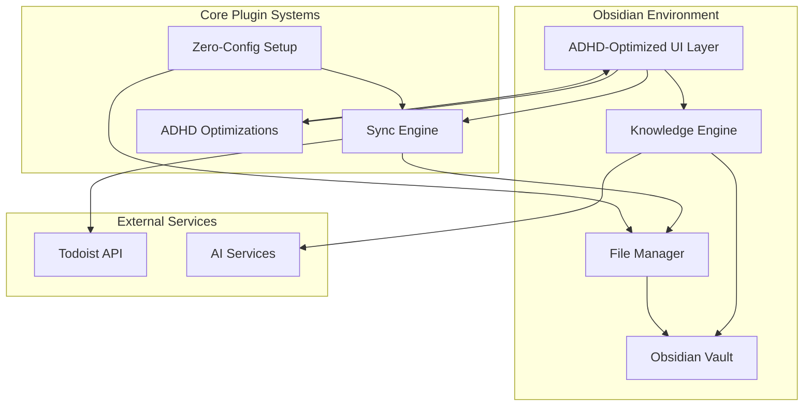
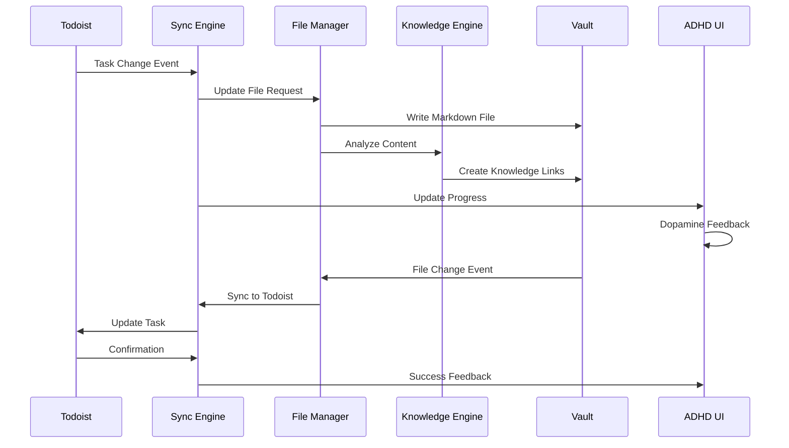

# High-Level Design

## System Overview
The ADHD-optimized Obsidian Todoist plugin is a bidirectional synchronization system that seamlessly integrates Todoist task management with Obsidian's knowledge management capabilities. The system prioritizes zero-configuration setup, cognitive load reduction, and automatic knowledge context integration while maintaining full compatibility with existing workflows.



## Core Components

### Zero-Configuration Setup System
Handles the complete plugin initialization with only an API token, automatically creating folder structures, applying ADHD-optimized defaults, and migrating existing data without user intervention.

### Bidirectional Sync Engine
Manages real-time synchronization between Todoist and Obsidian, handling conflict resolution, offline support, and maintaining 99.9% reliability with <5 second latency targets.

### ADHD-Optimized UI Layer
Provides cognitive load reduction through minimal decision points, dopamine-friendly feedback systems, hyperfocus protection, and workflow preservation mechanisms.

### Knowledge Integration Engine
Automatically analyzes task content to create bidirectional links with relevant notes, learns user patterns, and provides context-aware suggestions for enhanced productivity.

### Convention-Based File Manager
Manages automatic file organization using human-readable names, project-based folder structures, and maintains full compatibility with Obsidian Tasks plugin format.

### Performance Optimization System
Ensures responsive UI, efficient memory usage, and optimal sync performance through intelligent caching, batch operations, and resource management.

## Data Flow
The system follows a event-driven architecture where changes in either Todoist or Obsidian trigger bidirectional synchronization while the Knowledge Engine continuously analyzes content for automatic linking opportunities.



## Component Interactions
Components communicate through a centralized event system that ensures loose coupling while maintaining data consistency. The ADHD UI layer intercepts all user interactions to apply cognitive load reduction patterns before delegating to appropriate systems.

## Directory Structure
```
obsidian-todoist-plugin/
├── plugin/
│   ├── src/
│   │   ├── core/
│   │   │   ├── sync/              # Bidirectional sync engine
│   │   │   ├── knowledge/         # Knowledge integration
│   │   │   ├── adhd/              # ADHD optimizations
│   │   │   └── setup/             # Zero-config setup
│   │   ├── ui/
│   │   │   ├── components/        # ADHD-optimized components
│   │   │   ├── feedback/          # Dopamine-friendly feedback
│   │   │   └── focus/             # Hyperfocus support
│   │   ├── data/
│   │   │   ├── file-management/   # Convention-based files
│   │   │   ├── interoperability/  # Tasks plugin compatibility
│   │   │   └── migration/         # Migration support
│   │   └── api/
│   │       ├── todoist/           # Todoist API client
│   │       └── obsidian/          # Obsidian API wrapper
│   ├── tests/                     # Comprehensive test suite
│   └── package.json
├── docs/                          # DDD documentation
│   ├── designs/                   # Component designs
│   └── proposals/                 # Feature proposals
└── .agent3d-config.yml           # Project configuration
```

## Technical Decisions

### Event-Driven Architecture
**Rationale:** Enables loose coupling between components while maintaining real-time responsiveness and supporting offline scenarios.
**Alternatives Considered:** Direct method calls, polling-based updates
**Trade-offs:** Slightly more complex debugging in exchange for better scalability and maintainability

### Convention-Over-Configuration Pattern
**Rationale:** Eliminates cognitive overhead for ADHD users by removing all configuration decisions while maintaining flexibility through intelligent defaults.
**Alternatives Considered:** Traditional configuration-heavy approach, wizard-based setup
**Trade-offs:** Less customization flexibility in exchange for dramatically improved user experience

### TypeScript with Strict Mode
**Rationale:** Provides type safety and better IDE support while maintaining compatibility with Obsidian's plugin ecosystem.
**Alternatives Considered:** JavaScript, other typed languages
**Trade-offs:** Slightly longer development time in exchange for better maintainability and fewer runtime errors

### React for UI Components
**Rationale:** Enables component reusability and state management while providing familiar development patterns for contributors.
**Alternatives Considered:** Vanilla JavaScript, Vue, Svelte
**Trade-offs:** Larger bundle size in exchange for better developer experience and component reusability

## Dependencies
- **Obsidian Plugin API** - Core platform integration for vault access and UI rendering
- **Todoist REST API** - External task management service integration
- **React** - UI component framework for ADHD-optimized interface
- **TypeScript** - Type safety and enhanced development experience
- **Jest** - Testing framework for comprehensive test coverage
- **Rollup** - Module bundler optimized for plugin distribution

## Component Designs

For detailed implementation specifications of individual components, refer to the component design documents:

- **[Sync Engine](designs/sync-engine.md)** - Bidirectional synchronization system with conflict resolution
- **[Knowledge Engine](designs/knowledge-engine.md)** - Automatic content analysis and linking system
- **[ADHD UI System](designs/adhd-ui-system.md)** - Cognitive load reduction and dopamine-friendly interface
- **[Zero-Config Setup](designs/zero-config-setup.md)** - Painless initialization and migration system
- **[File Management](designs/file-management.md)** - Convention-based organization and interoperability
- **[Performance System](designs/performance-system.md)** - Optimization and monitoring framework
