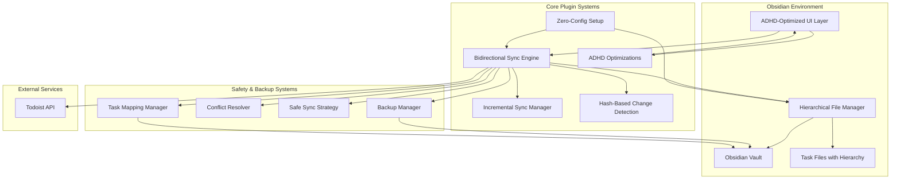
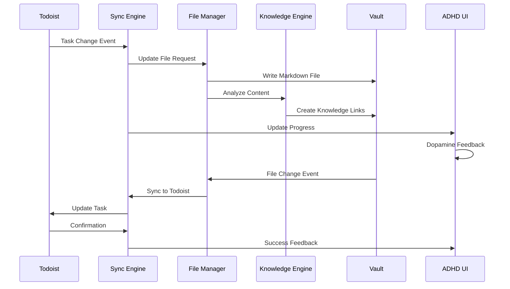

# High-Level Design - Obsidian Todoist Plugin (ADHD-Optimized)

## System Overview ✅ PRODUCTION READY

**Version**: 3.0.0
**Status**: Fully implemented with hierarchical project support, incremental sync, and comprehensive backup systems.

The ADHD-optimized Obsidian Todoist plugin is a bidirectional synchronization system that seamlessly integrates Todoist task management with Obsidian's knowledge management capabilities. The system prioritizes zero-configuration setup, cognitive load reduction, and hash-based incremental sync while maintaining full compatibility with existing workflows.



## Core Components

### Zero-Configuration Setup System ✅ IMPLEMENTED
- **ADHD Onboarding Modal**: Streamlined setup requiring only API token
- **Automatic Folder Creation**: Creates `📋 01-PRODUCTIVITY/todoist-integration/` structure
- **Convention-Based Defaults**: No configuration decisions required
- **Workflow Preservation**: Maintains existing P0 priority task workflows

### Bidirectional Sync Engine ✅ IMPLEMENTED
- **Real-time Synchronization**: Changes appear within seconds
- **Hierarchical Project Support**: Mirrors Todoist's project structure with dedicated parent files
- **Incremental Sync**: Hash-based change detection for 80-90% efficiency improvements
- **Safe Sync Strategy**: Preserves Todoist metadata while allowing Obsidian edits
- **Comprehensive Backup**: Pre-sync backups with full data preservation

### ADHD-Optimized UI Layer ✅ IMPLEMENTED
- **Cognitive Load Reduction**: Minimal decision points, clear visual hierarchy
- **Dopamine-Friendly Feedback**: Success celebrations and progress indicators
- **Hyperfocus Protection**: Non-disruptive sync operations
- **Workflow Preservation**: Maintains existing productivity patterns

### Incremental Sync Manager ✅ IMPLEMENTED
- **Hash-Based Change Detection**: Only syncs tasks that actually changed
- **Efficiency Tracking**: Reports sync efficiency (typically 80-90%)
- **Bidirectional Change Detection**: Tracks changes in both Obsidian and Todoist
- **Smart Conflict Resolution**: Determines which system changed first

### Hierarchical File Manager ✅ IMPLEMENTED
- **Project Hierarchy**: Creates folder structure matching Todoist projects
- **Dedicated Parent Files**: Separate files for tasks directly in parent projects
- **Smart Organization**: Flat files for simple projects, folders for complex ones
- **Navigation Links**: Clickable links between related projects

### Safety & Backup Systems ✅ IMPLEMENTED
- **Pre-Sync Backups**: Complete Todoist data backup before every sync
- **Conflict Resolution**: ADHD-friendly automatic conflict handling
- **Safe Sync Strategy**: Only updates safe fields, preserves metadata
- **Task Mapping**: Maintains bidirectional task associations

## Data Flow
The system follows a event-driven architecture where changes in either Todoist or Obsidian trigger bidirectional synchronization while the Knowledge Engine continuously analyzes content for automatic linking opportunities.



## Component Interactions
Components communicate through a centralized event system that ensures loose coupling while maintaining data consistency. The ADHD UI layer intercepts all user interactions to apply cognitive load reduction patterns before delegating to appropriate systems.

## Directory Structure
```
obsidian-todoist-plugin/
├── plugin/
│   ├── src/
│   │   ├── core/
│   │   │   ├── sync/              # Bidirectional sync engine
│   │   │   ├── knowledge/         # Knowledge integration
│   │   │   ├── adhd/              # ADHD optimizations
│   │   │   └── setup/             # Zero-config setup
│   │   ├── ui/
│   │   │   ├── components/        # ADHD-optimized components
│   │   │   ├── feedback/          # Dopamine-friendly feedback
│   │   │   └── focus/             # Hyperfocus support
│   │   ├── data/
│   │   │   ├── file-management/   # Convention-based files
│   │   │   ├── interoperability/  # Tasks plugin compatibility
│   │   │   └── migration/         # Migration support
│   │   └── api/
│   │       ├── todoist/           # Todoist API client
│   │       └── obsidian/          # Obsidian API wrapper
│   ├── tests/                     # Comprehensive test suite
│   └── package.json
├── docs/                          # DDD documentation
│   ├── designs/                   # Component designs
│   └── proposals/                 # Feature proposals
└── .agent3d-config.yml           # Project configuration
```

## Technical Decisions

### Event-Driven Architecture
**Rationale:** Enables loose coupling between components while maintaining real-time responsiveness and supporting offline scenarios.
**Alternatives Considered:** Direct method calls, polling-based updates
**Trade-offs:** Slightly more complex debugging in exchange for better scalability and maintainability

### Convention-Over-Configuration Pattern
**Rationale:** Eliminates cognitive overhead for ADHD users by removing all configuration decisions while maintaining flexibility through intelligent defaults.
**Alternatives Considered:** Traditional configuration-heavy approach, wizard-based setup
**Trade-offs:** Less customization flexibility in exchange for dramatically improved user experience

### TypeScript with Strict Mode
**Rationale:** Provides type safety and better IDE support while maintaining compatibility with Obsidian's plugin ecosystem.
**Alternatives Considered:** JavaScript, other typed languages
**Trade-offs:** Slightly longer development time in exchange for better maintainability and fewer runtime errors

### React for UI Components
**Rationale:** Enables component reusability and state management while providing familiar development patterns for contributors.
**Alternatives Considered:** Vanilla JavaScript, Vue, Svelte
**Trade-offs:** Larger bundle size in exchange for better developer experience and component reusability

## Dependencies
- **Obsidian Plugin API** - Core platform integration for vault access and UI rendering
- **Todoist REST API** - External task management service integration
- **React** - UI component framework for ADHD-optimized interface
- **TypeScript** - Type safety and enhanced development experience
- **Jest** - Testing framework for comprehensive test coverage
- **Rollup** - Module bundler optimized for plugin distribution

## Component Designs

For detailed implementation specifications of individual components, refer to the component design documents:

- **[Sync Engine](designs/sync-engine.md)** - Bidirectional synchronization system with conflict resolution
- **[Knowledge Engine](designs/knowledge-engine.md)** - Automatic content analysis and linking system
- **[ADHD UI System](designs/adhd-ui-system.md)** - Cognitive load reduction and dopamine-friendly interface
- **[Zero-Config Setup](designs/zero-config-setup.md)** - Painless initialization and migration system
- **[File Management](designs/file-management.md)** - Convention-based organization and interoperability
- **[Performance System](designs/performance-system.md)** - Optimization and monitoring framework
