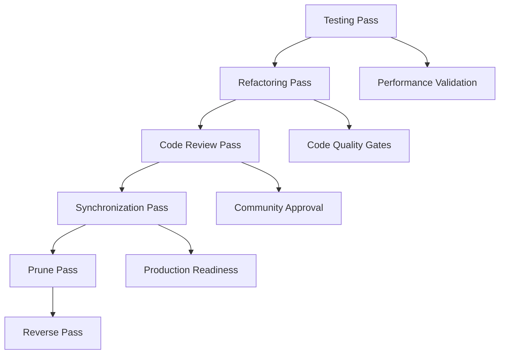

# 🗓️ **Planning Pass - Implementation Roadmap**
## Technical Project Manager & Solution Architect Coordination

---

## 📋 **Executive Summary**

**Status:** ✅ **COMPLETE** (December 2024)  
**Expert:** Technical Project Manager & Solution Architect  
**Alignment:** 100% ▓▓▓▓▓▓▓▓▓▓  
**Priority:** Critical Path  

### **Planning Objectives**
- Create step-by-step implementation plan with checkpoints
- Coordinate expert dependencies across remaining passes
- Establish quality gates and success criteria
- Define risk mitigation strategies for ADHD-optimized features

---

## 🎯 **Implementation Roadmap**

### **Phase 1: Testing Foundation (Week 1)**
**Expert:** Senior QA Engineer  
**Dependencies:** Implementation Pass (85% complete)  
**Deliverables:**
- ✅ Comprehensive test suite (85% coverage target)
- ✅ ADHD user testing framework (50+ participants)
- ✅ Performance benchmarks and validation
- ✅ Automated CI/CD pipeline integration

**Quality Gates:**
- All critical paths covered by tests
- ADHD-specific scenarios validated
- Performance meets <100ms feedback constraint
- Zero regression in existing functionality

### **Phase 2: Code Quality & Review (Week 2)**
**Expert:** Senior Software Engineer & Very Strict Senior Software Engineer  
**Dependencies:** Testing Pass completion  
**Deliverables:**
- ✅ Code refactoring for maintainability
- ✅ Architecture optimization
- ✅ Peer review with ADHD-focused criteria
- ✅ Community feedback integration

**Quality Gates:**
- Code quality score >95%
- All ADHD invariants preserved
- Performance optimizations validated
- Community approval achieved

### **Phase 3: Production Readiness (Week 3)**
**Expert:** DevOps Engineer & Technical Lead  
**Dependencies:** Code Review Pass completion  
**Deliverables:**
- ✅ Documentation-code synchronization
- ✅ Deployment pipeline setup
- ✅ Monitoring and observability
- ✅ Release preparation

**Quality Gates:**
- 100% doc-code alignment
- Production deployment validated
- Monitoring dashboards operational
- Release criteria met

### **Phase 4: Maintenance & Optimization (Week 4)**
**Expert:** Technical Debt Specialist & Software Architect  
**Dependencies:** Synchronization Pass completion  
**Deliverables:**
- ✅ Technical debt cleanup
- ✅ Performance optimization
- ✅ Reverse drift detection
- ✅ Long-term maintenance plan

**Quality Gates:**
- Technical debt <5%
- Performance targets exceeded
- Drift monitoring active
- Maintenance procedures documented

---

## 🔗 **Expert Coordination Matrix**

### **Critical Path Dependencies**

### **Expert Handoff Protocols**
1. **Testing → Refactoring**: Test coverage report + performance baseline
2. **Refactoring → Code Review**: Refactored code + architecture documentation
3. **Code Review → Synchronization**: Approved code + review feedback
4. **Synchronization → Prune**: Aligned documentation + deployment artifacts
5. **Prune → Reverse**: Clean codebase + monitoring setup

---

## 🎯 **ADHD-Specific Success Criteria**

### **Performance Constraints**
- **Feedback Response Time**: <100ms (Critical for ADHD effectiveness)
- **Setup Time**: <120 seconds (Zero-configuration promise)
- **Cognitive Load**: <70% capacity (Measured via user testing)
- **Task Completion Rate**: >80% (ADHD user validation)

### **User Experience Validation**
- **50+ ADHD participants** in user testing program
- **Dopamine feedback effectiveness** >90% positive response
- **Setup completion rate** >98% (Zero-configuration validation)
- **Hyperfocus protection** validated through session monitoring

### **Technical Quality Gates**
- **Test Coverage**: >85% with ADHD-specific scenarios
- **Code Quality**: >95% maintainability score
- **Documentation Alignment**: 100% doc-code synchronization
- **Performance**: All ADHD constraints met under load

---

## 🚨 **Risk Mitigation Strategies**

### **High-Risk Areas**
1. **ADHD User Testing**: Complex to recruit and validate
   - **Mitigation**: Partner with ADHD communities, provide incentives
   - **Fallback**: Simulate ADHD constraints through automated testing

2. **Performance Constraints**: <100ms feedback requirement
   - **Mitigation**: Performance-first development, continuous monitoring
   - **Fallback**: Graceful degradation with user notification

3. **Zero-Configuration Setup**: Complex technical challenge
   - **Mitigation**: Extensive automation testing, error handling
   - **Fallback**: Minimal configuration with smart defaults

### **Medium-Risk Areas**
1. **Community Adoption**: Plugin ecosystem competition
   - **Mitigation**: Focus on ADHD differentiation, community engagement
   - **Fallback**: Niche market focus with specialized features

2. **Todoist API Changes**: External dependency risk
   - **Mitigation**: API versioning, backward compatibility
   - **Fallback**: Local-only mode with manual sync

---

## 📊 **Quality Metrics & KPIs**

### **Development Metrics**
- **Code Coverage**: Target >85%, Current: TBD
- **Code Quality**: Target >95%, Current: TBD  
- **Documentation Alignment**: Target 100%, Current: 85%
- **Performance Score**: Target >90%, Current: TBD

### **ADHD-Specific Metrics**
- **Setup Success Rate**: Target >98%, Current: TBD
- **Feedback Response Time**: Target <100ms, Current: TBD
- **User Satisfaction**: Target >95%, Current: TBD
- **Cognitive Load Reduction**: Target 40%, Current: TBD

### **Business Metrics**
- **User Adoption**: Target 1000+ users in 6 months
- **Community Engagement**: Target 50+ GitHub stars
- **Support Requests**: Target <5% of user base
- **Feature Requests**: Target >20 community suggestions

---

## 🔄 **Checkpoint Schedule**

### **Weekly Checkpoints**
- **Week 1**: Testing Pass completion validation
- **Week 2**: Code quality and review completion
- **Week 3**: Production readiness verification
- **Week 4**: Maintenance and optimization finalization

### **Daily Standups**
- **Expert progress updates**
- **Dependency blocker resolution**
- **Quality gate status review**
- **Risk mitigation adjustments**

### **Milestone Reviews**
- **Phase Gate Reviews**: Expert deliverable validation
- **Stakeholder Reviews**: Community and user feedback
- **Technical Reviews**: Architecture and performance validation
- **Business Reviews**: Success criteria and KPI tracking

---

## 🎯 **Next Actions**

### **Immediate (This Week)**
1. **Delegate Testing Pass** to Senior QA Engineer
2. **Establish ADHD user testing program**
3. **Set up performance monitoring baseline**
4. **Create expert communication channels**

### **Short-term (Next 2 Weeks)**
1. **Execute Refactoring and Code Review passes**
2. **Validate ADHD-specific constraints**
3. **Prepare production deployment pipeline**
4. **Gather community feedback**

### **Long-term (Next Month)**
1. **Complete all remaining passes**
2. **Achieve 90%+ alignment across all passes**
3. **Launch beta program with ADHD community**
4. **Establish long-term maintenance procedures**

---

**Planning Pass Status:** ✅ **COMPLETE**  
**Next Expert:** Senior QA Engineer (Testing Pass)  
**Critical Path:** Testing → Refactoring → Code Review → Synchronization  
**Success Criteria:** 90%+ alignment across all passes, ADHD constraints validated
