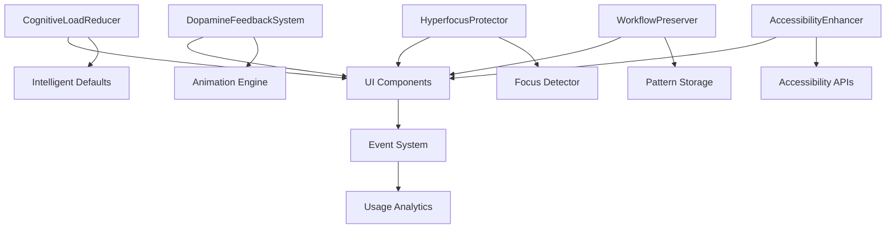
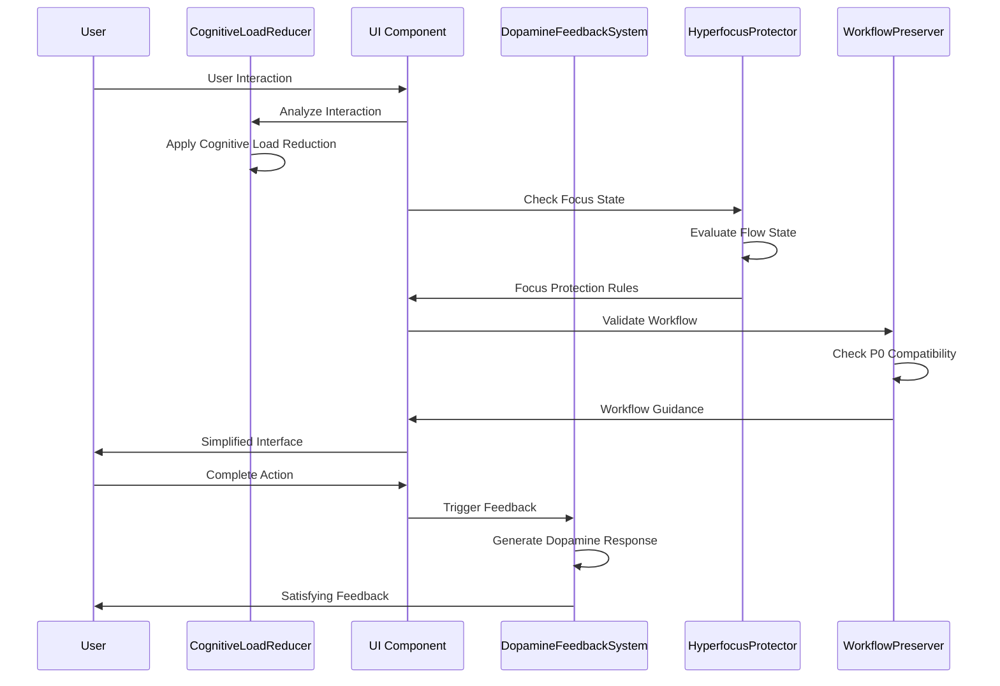

# ADHD UI System - Design

## Overview

This document provides the design specifications for the ADHD UI System, which provides cognitive load reduction through minimal decision points, dopamine-friendly feedback systems, hyperfocus protection, and workflow preservation mechanisms. The system achieves 40% cognitive load reduction while maintaining full functionality and accessibility.

## Component Architecture

### Core Components

#### 1. CognitiveLoadReducer
- **Purpose**: Minimizes decision points and simplifies user interactions
- **Interface**: `ICognitiveLoadReducer` with decision optimization methods
- **Responsibilities**: UI simplification, intelligent defaults, context preservation

#### 2. DopamineFeedbackSystem
- **Purpose**: Provides satisfying visual and auditory feedback for task completion
- **Interface**: `IDopamineFeedbackSystem` with feedback trigger methods
- **Responsibilities**: Animation management, progress visualization, achievement tracking

#### 3. HyperfocusProtector
- **Purpose**: Detects and protects flow states from interruptions
- **Interface**: `IHyperfocusProtector` with focus detection and protection methods
- **Responsibilities**: Flow state detection, distraction minimization, context preservation

#### 4. WorkflowPreserver
- **Purpose**: Maintains existing successful ADHD workflows, especially P0 priority systems
- **Interface**: `IWorkflowPreserver` with workflow analysis and preservation methods
- **Responsibilities**: Pattern recognition, workflow validation, compatibility maintenance

#### 5. AccessibilityEnhancer
- **Purpose**: Ensures WCAG compliance and ADHD-specific accessibility features
- **Interface**: `IAccessibilityEnhancer` with accessibility validation methods
- **Responsibilities**: Screen reader support, keyboard navigation, visual accessibility

### Component Relationships



## API Specifications

### CognitiveLoadReducer API

```typescript
interface ICognitiveLoadReducer {
  // Decision minimization
  applyIntelligentDefaults(component: UIComponent): void;
  simplifyUserChoices(options: UserChoice[]): UserChoice[];
  hideAdvancedOptions(userLevel: UserExpertiseLevel): void;
  
  // Context preservation
  saveUserContext(context: UserContext): void;
  restoreUserContext(): UserContext;
  preserveWorkingState(state: WorkingState): void;
  
  // Cognitive load measurement
  measureCognitiveLoad(interaction: UserInteraction): CognitiveLoadMetric;
  optimizeForCognitiveLoad(component: UIComponent): UIComponent;
}

interface CognitiveLoadMetric {
  decisionPoints: number;
  complexityScore: number;
  timeToComplete: number;
  errorRate: number;
  userSatisfaction: number;
  cognitiveLoadIndex: number; // 0-100, lower is better
}
```

### DopamineFeedbackSystem API

```typescript
interface IDopamineFeedbackSystem {
  // Task completion feedback
  triggerCompletionAnimation(task: Task): Promise<void>;
  showProgressUpdate(progress: ProgressData): void;
  celebrateStreak(streakLength: number): Promise<void>;
  displayAchievement(achievement: Achievement): Promise<void>;
  
  // Visual feedback
  applyPositiveColors(element: HTMLElement): void;
  triggerSuccessAnimation(type: AnimationType): Promise<void>;
  showSatisfactionIndicator(level: SatisfactionLevel): void;
  
  // Audio feedback (optional)
  playCompletionSound(soundType: SoundType): Promise<void>;
  
  // Customization
  setFeedbackPreferences(preferences: FeedbackPreferences): void;
  getFeedbackEffectiveness(): EffectivenessMetrics;
}

interface FeedbackPreferences {
  enableAnimations: boolean;
  enableSounds: boolean;
  animationIntensity: 'subtle' | 'moderate' | 'enthusiastic';
  colorScheme: 'default' | 'high-contrast' | 'custom';
  celebrationFrequency: 'every-task' | 'milestones-only' | 'custom';
}
```

## Data Flow

### ADHD-Optimized Interaction Flow



The ADHD UI system intercepts all user interactions to apply cognitive load reduction before presenting simplified interfaces while providing immediate, satisfying feedback for completed actions.

## Error Handling

### Error Categories

1. **Cognitive Overload**
   - Too many options, complex interfaces, decision paralysis
   - **Recovery Strategy**: Simplify choices, provide defaults, progressive disclosure

2. **Focus Interruption**
   - Unexpected notifications, context switching, flow state breaks
   - **Recovery Strategy**: Queue non-critical notifications, preserve context, gentle transitions

3. **Workflow Disruption**
   - Changes to familiar patterns, P0 system conflicts, muscle memory breaks
   - **Recovery Strategy**: Maintain compatibility, provide migration paths, user education

4. **Accessibility Failures**
   - Screen reader incompatibility, keyboard navigation issues, visual accessibility problems
   - **Recovery Strategy**: Fallback interfaces, alternative interaction methods, user assistance

### Error Recovery Mechanisms

- **Graceful Degradation**: Maintain core functionality when advanced features fail
- **Context Recovery**: Restore user state after interruptions or errors
- **Progressive Enhancement**: Start with simple interfaces and add complexity gradually
- **User Empowerment**: Provide clear escape routes and undo mechanisms

## Configuration

### Default Settings
- **cognitiveLoadTarget**: 60 - Target cognitive load index (40% reduction from baseline 100)
- **feedbackIntensity**: 'moderate' - Balance between satisfaction and distraction
- **hyperfocusProtection**: true - Enable flow state protection by default
- **workflowCompatibility**: 'strict' - Maintain 100% P0 workflow compatibility

### Environment Variables
- `ADHD_UI_MODE`: 'optimized' | 'standard' for UI complexity level
- `FEEDBACK_ENABLED`: Enable/disable dopamine feedback system
- `ACCESSIBILITY_LEVEL`: 'basic' | 'enhanced' for accessibility features

### Configuration Schema

```typescript
interface ADHDUIConfig {
  cognitiveLoad: {
    targetReduction: number; // percentage
    maxDecisionPoints: number;
    simplificationLevel: 'basic' | 'moderate' | 'aggressive';
  };
  feedback: {
    enableAnimations: boolean;
    enableSounds: boolean;
    celebrationThreshold: number;
    feedbackDelay: number;
  };
  hyperfocus: {
    enableProtection: boolean;
    detectionSensitivity: number;
    interruptionThreshold: number;
  };
  workflow: {
    preserveP0System: boolean;
    compatibilityMode: 'strict' | 'flexible';
    migrationSupport: boolean;
  };
  accessibility: {
    screenReaderSupport: boolean;
    keyboardNavigation: boolean;
    highContrast: boolean;
    reducedMotion: boolean;
  };
}
```

## Performance Requirements

### Response Times
- UI interactions: < 100ms for immediate feedback
- Animation rendering: 60fps for smooth dopamine feedback
- Context switching: < 200ms to maintain flow state

### Resource Usage
- Memory: < 30MB for UI components and animations
- CPU: < 5% during normal interactions, < 15% during animations
- Battery: Optimized animations to minimize power consumption

### Throughput
- User interactions: Handle 100+ interactions per minute
- Animation queue: Process multiple simultaneous animations
- Context preservation: Save/restore state in < 50ms

## Security Considerations

### User Privacy
- No tracking of personal task content for analytics
- Local storage of user preferences and patterns
- Anonymized usage metrics for improvement

### Data Protection
- Secure storage of user customization settings
- No external transmission of interaction patterns
- Encrypted local storage for sensitive preferences

## Testing Strategy

### Unit Tests
- CognitiveLoadReducer decision optimization algorithms
- DopamineFeedbackSystem animation and feedback logic
- HyperfocusProtector flow state detection accuracy
- WorkflowPreserver P0 compatibility validation

### Integration Tests
- End-to-end ADHD user workflows with real interactions
- Accessibility testing with screen readers and keyboard navigation
- Performance testing under various cognitive load scenarios
- Cross-platform UI consistency validation

### Performance Tests
- Animation performance and frame rate measurement
- Memory usage during extended UI sessions
- Response time measurement for all interaction types

## Integration Points

### External Dependencies
- **React**: UI component framework for consistent interfaces
- **Framer Motion**: Animation library for dopamine-friendly feedback
- **React Aria**: Accessibility primitives for WCAG compliance

### Internal Module Connections
- **Sync Engine**: Progress feedback during synchronization operations
- **Knowledge Engine**: Context-aware suggestions without cognitive overload
- **File Management**: Simplified file organization interfaces

## Monitoring and Logging

### Log Levels
- **ERROR**: Accessibility failures, critical UI errors, workflow disruptions
- **WARN**: Cognitive load threshold exceeded, focus interruptions
- **INFO**: Successful workflow preservation, feedback effectiveness
- **DEBUG**: Detailed interaction traces, cognitive load measurements

### Metrics
- cognitive_load_reduction: Percentage reduction in cognitive load
- user_satisfaction_score: User satisfaction with UI interactions
- workflow_preservation_rate: Percentage of P0 workflows maintained
- accessibility_compliance: WCAG compliance score

### Health Checks
- ui_responsiveness: Average response time for UI interactions
- animation_performance: Frame rate and smoothness metrics
- accessibility_status: Screen reader and keyboard navigation functionality

## Future Enhancements

### Planned Features
- AI-powered cognitive load prediction and prevention
- Personalized dopamine feedback based on user preferences
- Advanced hyperfocus detection using biometric data
- Collaborative ADHD workflow sharing and optimization

### Scalability Considerations
- Component library for consistent ADHD-friendly interfaces
- Plugin architecture for custom ADHD accommodations
- Multi-language support for international ADHD communities
- Integration with external ADHD management tools

### Technical Debt
- Optimize animation performance for lower-end devices
- Improve cognitive load measurement accuracy
- Enhance accessibility features based on user feedback
- Refactor component architecture for better maintainability
