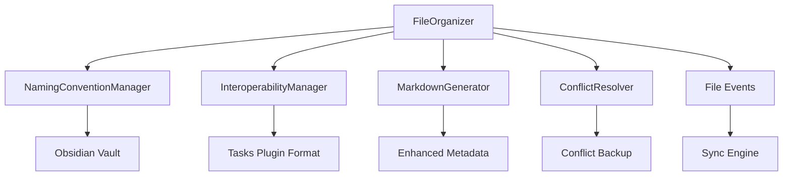
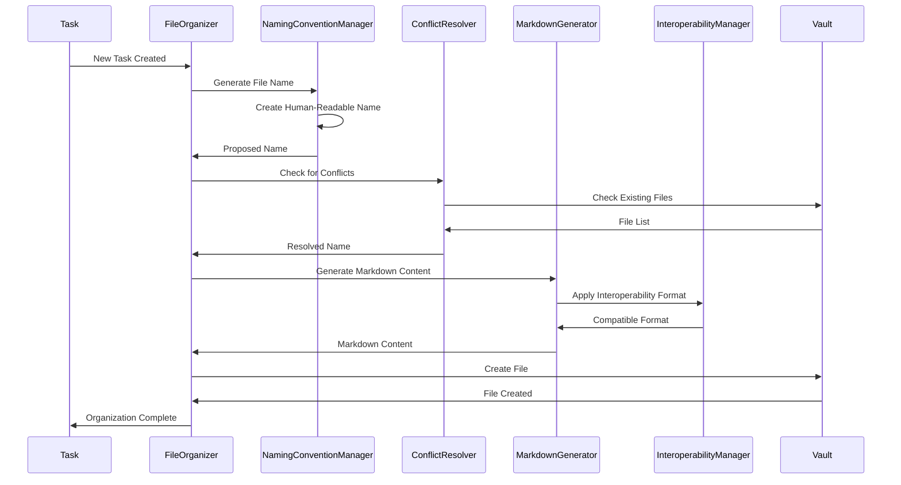

# File Management - Design

## Overview

This document provides the design specifications for the File Management system, which manages automatic file organization using human-readable names, project-based folder structures, and maintains full compatibility with Obsidian Tasks plugin format. The system ensures 100% interoperability while providing convention-based organization that eliminates user configuration decisions.

## Component Architecture

### Core Components

#### 1. FileOrganizer
- **Purpose**: Manages automatic file organization and folder structure creation
- **Interface**: `IFileOrganizer` with organization and structure methods
- **Responsibilities**: Folder creation, file placement, structure maintenance

#### 2. NamingConventionManager
- **Purpose**: Generates human-readable file names from task content
- **Interface**: `INamingConventionManager` with naming and conflict resolution methods
- **Responsibilities**: Name generation, conflict resolution, uniqueness validation

#### 3. InteroperabilityManager
- **Purpose**: Ensures full compatibility with Obsidian Tasks plugin format
- **Interface**: `IInteroperabilityManager` with format conversion methods
- **Responsibilities**: Format validation, dual-format support, compatibility maintenance

#### 4. MarkdownGenerator
- **Purpose**: Creates properly formatted markdown files with enhanced metadata
- **Interface**: `IMarkdownGenerator` with content generation methods
- **Responsibilities**: Markdown creation, metadata embedding, link preservation

#### 5. ConflictResolver
- **Purpose**: Handles file naming conflicts and duplicate resolution
- **Interface**: `IConflictResolver` with conflict detection and resolution methods
- **Responsibilities**: Conflict detection, resolution strategies, user notification

### Component Relationships



## API Specifications

### FileOrganizer API

```typescript
interface IFileOrganizer {
  // File organization
  organizeTaskFile(task: Task): Promise<FileOrganizationResult>;
  createProjectFolder(project: Project): Promise<FolderCreationResult>;
  moveTaskToProject(taskId: string, projectId: string): Promise<MoveResult>;
  
  // Structure management
  validateFolderStructure(): Promise<ValidationResult>;
  repairFolderStructure(): Promise<RepairResult>;
  getOrganizationStats(): OrganizationStats;
  
  // Cleanup operations
  cleanupEmptyFolders(): Promise<CleanupResult>;
  archiveCompletedTasks(): Promise<ArchiveResult>;
  
  // Event handling
  onFileCreated(callback: (file: FileInfo) => void): void;
  onFileUpdated(callback: (file: FileInfo) => void): void;
  onFileDeleted(callback: (file: FileInfo) => void): void;
}

interface FileOrganizationResult {
  success: boolean;
  filePath: string;
  fileName: string;
  folderCreated: boolean;
  conflictsResolved: number;
  backupCreated: boolean;
}
```

### NamingConventionManager API

```typescript
interface INamingConventionManager {
  // Name generation
  generateFileName(taskContent: string): string;
  generateUniqueFileName(baseName: string, folder: string): Promise<string>;
  validateFileName(fileName: string): ValidationResult;
  
  // Conflict resolution
  resolveNamingConflict(proposedName: string, existingNames: string[]): string;
  suggestAlternativeNames(baseName: string): string[];
  
  // Convention management
  setNamingConvention(convention: NamingConvention): void;
  getNamingConvention(): NamingConvention;
}

interface NamingConvention {
  maxLength: number;
  allowedCharacters: RegExp;
  replacementChar: string;
  caseStyle: 'preserve' | 'lowercase' | 'title';
  conflictResolution: 'append-number' | 'append-timestamp' | 'append-uuid';
}
```

## Data Flow

### File Organization Flow



The file management system automatically organizes tasks into a logical folder structure while maintaining full compatibility with existing Obsidian Tasks plugin workflows.

## Error Handling

### Error Categories

1. **File System Errors**
   - Permission denied, disk space, file locks, path too long
   - **Recovery Strategy**: Alternative locations, permission requests, path shortening

2. **Naming Conflicts**
   - Duplicate names, invalid characters, reserved names
   - **Recovery Strategy**: Automatic conflict resolution, alternative naming, user notification

3. **Format Compatibility Issues**
   - Invalid markdown, metadata corruption, link breaks
   - **Recovery Strategy**: Format validation, backup restoration, manual recovery

4. **Organization Failures**
   - Folder creation errors, structure corruption, missing dependencies
   - **Recovery Strategy**: Structure repair, fallback organization, integrity validation

### Error Recovery Mechanisms

- **Automatic Backup**: Create backups before risky operations
- **Graceful Fallback**: Use simpler organization when advanced features fail
- **Structure Repair**: Automatically detect and repair organization issues
- **User Transparency**: Clear feedback about organization status and issues

## Configuration

### Default Settings
- **rootFolder**: "Todoist" - Main folder for all organized tasks
- **projectSubfolders**: true - Create subfolders for each project
- **namingConvention**: "human-readable" - Generate readable file names
- **conflictResolution**: "append-number" - Handle naming conflicts automatically

### Environment Variables
- `FILE_ORG_ROOT`: Override default root folder name
- `FILE_ORG_MODE`: 'automatic' | 'manual' for organization behavior
- `FILE_ORG_BACKUP`: Enable/disable automatic backups

### Configuration Schema

```typescript
interface FileManagementConfig {
  organization: {
    rootFolder: string;
    createProjectSubfolders: boolean;
    createDateSubfolders: boolean;
    maxFolderDepth: number;
  };
  naming: {
    convention: NamingConvention;
    maxFileNameLength: number;
    sanitizeSpecialChars: boolean;
    preserveOriginalCase: boolean;
  };
  interoperability: {
    enableTasksPluginFormat: boolean;
    enableEnhancedMetadata: boolean;
    maintainBackwardCompatibility: boolean;
  };
  maintenance: {
    enableAutoCleanup: boolean;
    archiveCompletedTasks: boolean;
    cleanupEmptyFolders: boolean;
    backupBeforeChanges: boolean;
  };
}
```

## Performance Requirements

### Response Times
- File creation: < 500ms for single file operations
- Folder organization: < 2 seconds for complete project organization
- Conflict resolution: < 1 second for automatic resolution

### Resource Usage
- Memory: < 20MB for file organization operations
- CPU: < 5% during normal file operations
- Storage: Minimal overhead for metadata and backups

### Throughput
- File operations: 100+ files per minute for batch operations
- Organization updates: Real-time response to task changes
- Conflict resolution: Handle multiple conflicts simultaneously

## Security Considerations

### File System Security
- Validate all file paths to prevent directory traversal
- Sanitize file names to prevent injection attacks
- Respect file system permissions and access controls

### Data Integrity
- Backup files before destructive operations
- Validate file content before writing
- Maintain audit trail of file operations

## Testing Strategy

### Unit Tests
- FileOrganizer folder creation and file placement logic
- NamingConventionManager name generation and conflict resolution
- InteroperabilityManager format compatibility validation
- MarkdownGenerator content creation and metadata handling

### Integration Tests
- End-to-end file organization workflows with real vault
- Interoperability testing with Obsidian Tasks plugin
- Performance testing with large numbers of files
- Cross-platform file system compatibility

### Performance Tests
- File operation speed with various vault sizes
- Memory usage during batch organization operations
- Conflict resolution performance with many duplicates

## Integration Points

### External Dependencies
- **Obsidian Plugin API**: Vault access and file system operations
- **Node.js fs module**: File system operations and path handling

### Internal Module Connections
- **Sync Engine**: File updates trigger sync operations
- **Knowledge Engine**: File content analysis for automatic linking
- **ADHD UI System**: Progress feedback during organization operations

## Monitoring and Logging

### Log Levels
- **ERROR**: File operation failures, permission errors, data corruption
- **WARN**: Naming conflicts, organization issues, performance degradation
- **INFO**: Successful organization, folder creation, conflict resolution
- **DEBUG**: Detailed file operations, naming decisions, format conversions

### Metrics
- file_operations_total: Counter of file operations by type
- organization_success_rate: Percentage of successful file organizations
- naming_conflicts_resolved: Counter of automatically resolved naming conflicts
- interoperability_compliance: Percentage of files maintaining format compatibility

### Health Checks
- vault_access: Obsidian vault read/write permissions
- folder_structure_integrity: Organization structure validation
- file_format_compliance: Interoperability format validation

## Future Enhancements

### Planned Features
- Smart folder organization based on task content and patterns
- Advanced conflict resolution with user preferences
- Bulk organization tools for existing unorganized files
- Integration with external file organization systems

### Scalability Considerations
- Parallel file operations for improved performance
- Distributed file organization for team vaults
- Advanced caching for large vault operations
- Optimized indexing for fast file lookups

### Technical Debt
- Improve file name generation algorithms for better readability
- Optimize folder structure for very large numbers of tasks
- Enhance interoperability testing with more plugin combinations
- Better error recovery for complex file system scenarios
