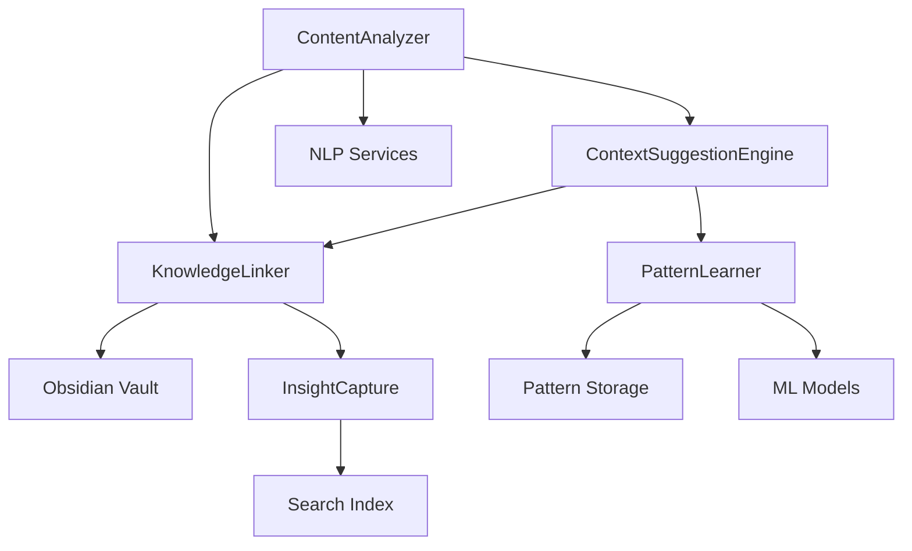
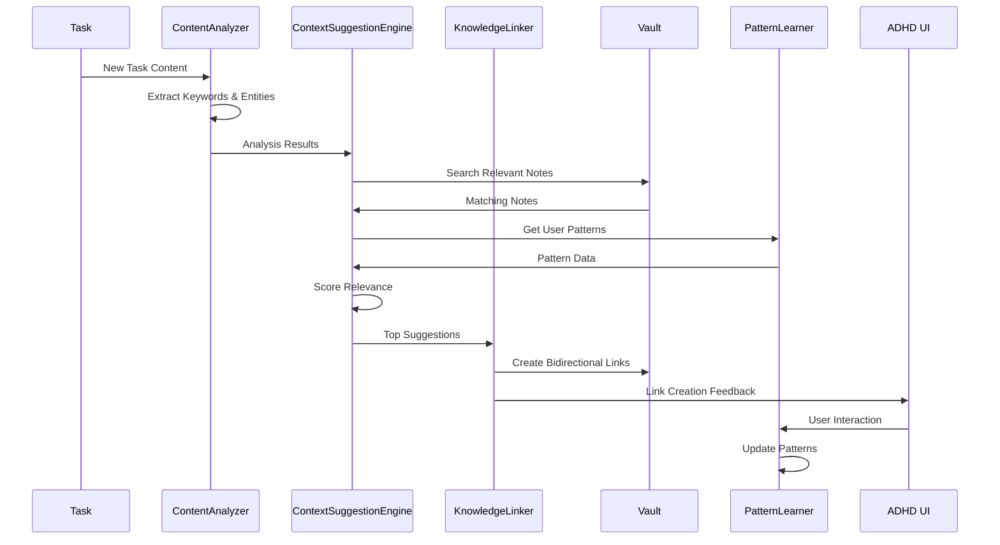

# Knowledge Engine - Design

## Overview

This document provides the design specifications for the Knowledge Engine, which automatically analyzes task content to create bidirectional links with relevant notes, learns user patterns, and provides context-aware suggestions. The engine achieves 80% automatic linking rate while supporting ADHD users through intelligent context discovery and minimal cognitive overhead.

## Component Architecture

### Core Components

#### 1. ContentAnalyzer
- **Purpose**: Analyzes task content using NLP to extract semantic meaning and context
- **Interface**: `IContentAnalyzer` with text analysis and entity extraction methods
- **Responsibilities**: Text processing, keyword extraction, semantic analysis

#### 2. KnowledgeLinker
- **Purpose**: Creates and maintains bidirectional links between tasks and notes
- **Interface**: `IKnowledgeLinker` with link creation and management operations
- **Responsibilities**: Link creation, relationship mapping, link integrity

#### 3. ContextSuggestionEngine
- **Purpose**: Provides intelligent suggestions for task-note relationships
- **Interface**: `IContextSuggestionEngine` with suggestion generation methods
- **Responsibilities**: Relevance scoring, suggestion ranking, user preference learning

#### 4. PatternLearner
- **Purpose**: Learns from user behavior to improve suggestion accuracy over time
- **Interface**: `IPatternLearner` with learning and prediction methods
- **Responsibilities**: Behavior analysis, pattern recognition, model updates

#### 5. InsightCapture
- **Purpose**: Captures and organizes insights from completed tasks
- **Interface**: `IInsightCapture` with insight collection and storage methods
- **Responsibilities**: Insight extraction, knowledge base updates, searchable indexing

### Component Relationships



## API Specifications

### ContentAnalyzer API

```typescript
interface IContentAnalyzer {
  // Core analysis methods
  analyzeTaskContent(content: string): Promise<ContentAnalysis>;
  extractEntities(text: string): Promise<Entity[]>;
  calculateSimilarity(text1: string, text2: string): Promise<number>;
  
  // Batch operations
  analyzeBatch(contents: string[]): Promise<ContentAnalysis[]>;
  
  // Configuration
  setAnalysisDepth(depth: 'basic' | 'detailed' | 'comprehensive'): void;
  updateLanguageModel(model: LanguageModel): Promise<void>;
}

interface ContentAnalysis {
  keywords: string[];
  entities: Entity[];
  topics: Topic[];
  sentiment: SentimentScore;
  complexity: number;
  relevanceScore: number;
  suggestedCategories: string[];
}

interface Entity {
  text: string;
  type: 'person' | 'place' | 'organization' | 'concept' | 'project';
  confidence: number;
  startIndex: number;
  endIndex: number;
}
```

### KnowledgeLinker API

```typescript
interface IKnowledgeLinker {
  // Link management
  createLink(taskId: string, noteId: string, linkType: LinkType): Promise<Link>;
  removeLink(linkId: string): Promise<void>;
  updateLinkStrength(linkId: string, strength: number): Promise<void>;
  
  // Link discovery
  findRelevantNotes(taskContent: string): Promise<RelevantNote[]>;
  suggestLinks(taskId: string): Promise<LinkSuggestion[]>;
  
  // Bidirectional operations
  getLinkedNotes(taskId: string): Promise<LinkedNote[]>;
  getLinkedTasks(noteId: string): Promise<LinkedTask[]>;
  
  // Maintenance
  validateLinkIntegrity(): Promise<ValidationResult>;
  cleanupBrokenLinks(): Promise<CleanupResult>;
}

interface RelevantNote {
  noteId: string;
  title: string;
  relevanceScore: number;
  matchingConcepts: string[];
  linkSuggestion: string;
  confidence: number;
}
```

## Data Flow

### Automatic Linking Flow



The knowledge engine processes task content in real-time, analyzing semantic meaning and automatically creating relevant links while learning from user behavior to improve accuracy.

## Error Handling

### Error Categories

1. **Analysis Failures**
   - NLP service unavailable, malformed content, language detection issues
   - **Recovery Strategy**: Fallback to keyword-based analysis, graceful degradation

2. **Link Creation Errors**
   - File access issues, circular references, invalid note IDs
   - **Recovery Strategy**: Retry with validation, user notification, link queue

3. **Pattern Learning Failures**
   - Insufficient data, model corruption, storage issues
   - **Recovery Strategy**: Reset to defaults, rebuild patterns, backup restoration

4. **Performance Degradation**
   - High CPU usage, memory leaks, slow response times
   - **Recovery Strategy**: Throttling, background processing, resource optimization

### Error Recovery Mechanisms

- **Graceful Fallback**: Use simpler algorithms when advanced features fail
- **Background Recovery**: Retry failed operations during idle periods
- **User Transparency**: Clear feedback about analysis status and limitations
- **Data Protection**: Ensure no data loss during error scenarios

## Configuration

### Default Settings
- **analysisDepth**: 'detailed' - Balance between accuracy and performance
- **autoLinkThreshold**: 0.7 - Confidence threshold for automatic linking
- **maxSuggestions**: 5 - ADHD-optimized to prevent decision paralysis
- **learningEnabled**: true - Continuous improvement through user feedback

### Environment Variables
- `KNOWLEDGE_ENGINE_MODE`: 'local' | 'cloud' for processing location
- `NLP_SERVICE_URL`: External NLP service endpoint if using cloud processing
- `PATTERN_STORAGE_PATH`: Location for storing learned patterns

### Configuration Schema

```typescript
interface KnowledgeEngineConfig {
  analysis: {
    depth: 'basic' | 'detailed' | 'comprehensive';
    languageModel: string;
    enableEntityExtraction: boolean;
    enableSentimentAnalysis: boolean;
  };
  linking: {
    autoLinkThreshold: number;
    maxAutoLinks: number;
    bidirectionalLinks: boolean;
    linkStrengthDecay: number;
  };
  suggestions: {
    maxSuggestions: number;
    suggestionTimeout: number;
    enableRealTimeSuggestions: boolean;
  };
  learning: {
    enablePatternLearning: boolean;
    learningRate: number;
    patternRetentionDays: number;
  };
}
```

## Performance Requirements

### Response Times
- Content analysis: < 2 seconds for typical task content
- Link suggestions: < 1 second for real-time suggestions
- Pattern learning: Background processing, no user-visible delay

### Resource Usage
- Memory: < 100MB for analysis models and cached patterns
- CPU: < 10% during active analysis operations
- Storage: < 50MB for pattern data and link indices

### Throughput
- Analysis operations: 50+ tasks per minute
- Link creation: 100+ links per minute
- Suggestion generation: Real-time with <500ms latency

## Security Considerations

### Data Privacy
- All content analysis happens locally when possible
- No task content sent to external services without explicit consent
- Pattern data anonymized and encrypted

### Content Security
- Sanitize all text input to prevent injection attacks
- Validate note IDs and file paths before access
- Secure storage of learned patterns and user preferences

## Testing Strategy

### Unit Tests
- ContentAnalyzer accuracy with various text types
- KnowledgeLinker link creation and maintenance
- ContextSuggestionEngine relevance scoring
- PatternLearner model updates and predictions

### Integration Tests
- End-to-end linking workflows with real vault content
- Performance testing with large knowledge bases
- User behavior simulation for pattern learning validation
- Cross-platform compatibility testing

### Performance Tests
- Analysis speed with various content sizes
- Memory usage during extended operations
- Suggestion accuracy measurement over time

## Integration Points

### External Dependencies
- **NLP Libraries**: spaCy, natural, or cloud NLP services for text analysis
- **Machine Learning**: TensorFlow.js or similar for pattern learning

### Internal Module Connections
- **Sync Engine**: Triggers analysis when tasks are created or updated
- **File Management**: Accesses vault content for note analysis
- **ADHD UI System**: Displays suggestions and link feedback

## Monitoring and Logging

### Log Levels
- **ERROR**: Analysis failures, link creation errors, pattern corruption
- **WARN**: Low confidence suggestions, performance degradation
- **INFO**: Successful link creation, pattern learning updates
- **DEBUG**: Detailed analysis results, suggestion scoring

### Metrics
- analysis_operations_total: Counter of content analysis operations
- link_creation_success_rate: Percentage of successful link creations
- suggestion_accuracy: User acceptance rate of suggestions
- pattern_learning_effectiveness: Improvement in suggestion quality over time

### Health Checks
- analysis_service_health: Content analysis service availability
- link_integrity: Percentage of valid links in the system
- pattern_model_health: Machine learning model performance metrics

## Future Enhancements

### Planned Features
- Multi-language support for international users
- Advanced semantic search across linked content
- Collaborative knowledge sharing for team workflows
- Integration with external knowledge bases and APIs

### Scalability Considerations
- Distributed processing for large knowledge bases
- Cloud-based analysis for enhanced capabilities
- Federated learning for privacy-preserving pattern sharing
- Advanced caching strategies for frequently accessed content

### Technical Debt
- Optimize NLP model loading and memory usage
- Improve suggestion ranking algorithms
- Enhance pattern learning with more sophisticated ML models
- Better handling of edge cases in content analysis
