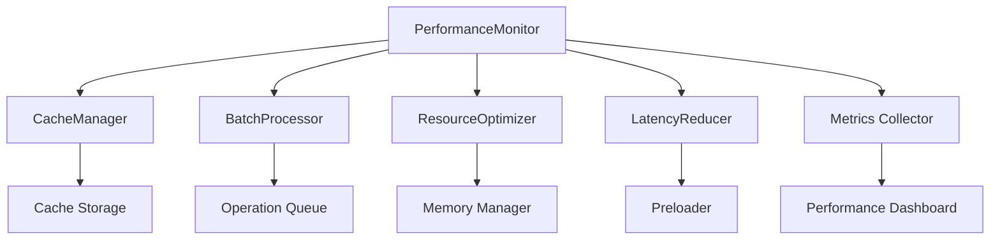
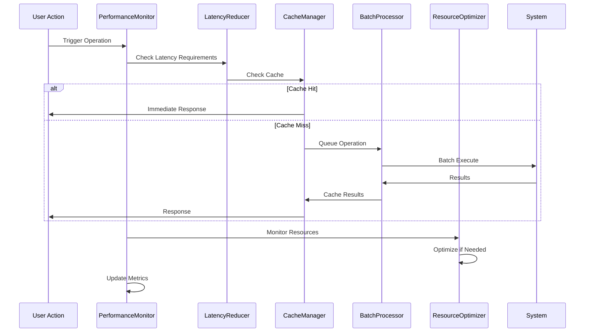

# Performance System - Design

## Overview

This document provides the design specifications for the Performance System, which ensures responsive UI, efficient memory usage, and optimal sync performance through intelligent caching, batch operations, and resource management. The system maintains <5 second sync latency, <100MB memory usage, and 60fps UI responsiveness while supporting ADHD users' need for immediate feedback.

## Component Architecture

### Core Components

#### 1. PerformanceMonitor
- **Purpose**: Continuously monitors system performance and resource usage
- **Interface**: `IPerformanceMonitor` with monitoring and alerting methods
- **Responsibilities**: Metrics collection, threshold monitoring, performance alerting

#### 2. CacheManager
- **Purpose**: Manages intelligent caching strategies for improved performance
- **Interface**: `ICacheManager` with cache operations and optimization methods
- **Responsibilities**: Cache storage, invalidation, optimization, memory management

#### 3. BatchProcessor
- **Purpose**: Optimizes operations through intelligent batching and queuing
- **Interface**: `IBatchProcessor` with batch operation methods
- **Responsibilities**: Operation batching, queue management, throughput optimization

#### 4. ResourceOptimizer
- **Purpose**: Optimizes memory, CPU, and network resource usage
- **Interface**: `IResourceOptimizer` with optimization and cleanup methods
- **Responsibilities**: Memory management, CPU optimization, resource cleanup

#### 5. LatencyReducer
- **Purpose**: Minimizes latency for critical ADHD-sensitive operations
- **Interface**: `ILatencyReducer` with latency optimization methods
- **Responsibilities**: Operation prioritization, preloading, response optimization

### Component Relationships



## API Specifications

### PerformanceMonitor API

```typescript
interface IPerformanceMonitor {
  // Monitoring operations
  startMonitoring(): void;
  stopMonitoring(): void;
  getPerformanceMetrics(): PerformanceMetrics;
  
  // Threshold management
  setPerformanceThresholds(thresholds: PerformanceThresholds): void;
  checkThresholds(): ThresholdCheckResult;
  
  // Alerting
  onPerformanceAlert(callback: (alert: PerformanceAlert) => void): void;
  onThresholdExceeded(callback: (threshold: ThresholdViolation) => void): void;
  
  // Optimization triggers
  triggerOptimization(type: OptimizationType): Promise<OptimizationResult>;
  scheduleOptimization(schedule: OptimizationSchedule): void;
}

interface PerformanceMetrics {
  memory: MemoryMetrics;
  cpu: CPUMetrics;
  network: NetworkMetrics;
  ui: UIMetrics;
  sync: SyncMetrics;
  timestamp: Date;
}

interface MemoryMetrics {
  heapUsed: number;
  heapTotal: number;
  external: number;
  rss: number;
  cacheSize: number;
  leakDetected: boolean;
}
```

### CacheManager API

```typescript
interface ICacheManager {
  // Cache operations
  set(key: string, value: any, ttl?: number): Promise<void>;
  get(key: string): Promise<any>;
  delete(key: string): Promise<boolean>;
  clear(): Promise<void>;
  
  // Cache optimization
  optimize(): Promise<OptimizationResult>;
  preload(keys: string[]): Promise<PreloadResult>;
  invalidatePattern(pattern: string): Promise<number>;
  
  // Cache analytics
  getCacheStats(): CacheStats;
  getCacheHitRate(): number;
  getCacheSize(): number;
  
  // Memory management
  setMemoryLimit(limitMB: number): void;
  evictLRU(count: number): Promise<number>;
}

interface CacheStats {
  hits: number;
  misses: number;
  hitRate: number;
  size: number;
  memoryUsage: number;
  evictions: number;
}
```

## Data Flow

### Performance Optimization Flow



The performance system continuously monitors and optimizes all operations to maintain ADHD-friendly responsiveness while efficiently managing system resources.

## Error Handling

### Error Categories

1. **Performance Degradation**
   - High latency, memory leaks, CPU spikes, unresponsive UI
   - **Recovery Strategy**: Automatic optimization, resource cleanup, operation throttling

2. **Resource Exhaustion**
   - Out of memory, disk space, network bandwidth limits
   - **Recovery Strategy**: Aggressive cleanup, cache eviction, operation deferral

3. **Cache Failures**
   - Cache corruption, storage errors, invalidation failures
   - **Recovery Strategy**: Cache rebuild, fallback to direct operations, data recovery

4. **Optimization Failures**
   - Optimization algorithms fail, performance regression, system instability
   - **Recovery Strategy**: Rollback optimizations, safe mode operation, manual intervention

### Error Recovery Mechanisms

- **Graceful Degradation**: Maintain core functionality when performance features fail
- **Automatic Recovery**: Self-healing mechanisms for common performance issues
- **Resource Protection**: Prevent system exhaustion through proactive management
- **User Transparency**: Clear feedback about performance status without overwhelming users

## Configuration

### Default Settings
- **memoryLimit**: 100MB - Maximum memory usage for optimal performance
- **cacheSize**: 50MB - Balance between performance and memory usage
- **syncLatencyTarget**: 5000ms - Maximum acceptable sync latency
- **uiResponseTarget**: 100ms - Target for immediate UI feedback

### Environment Variables
- `PERF_MONITORING_ENABLED`: Enable/disable performance monitoring
- `PERF_CACHE_SIZE`: Override default cache size limit
- `PERF_OPTIMIZATION_LEVEL`: 'conservative' | 'aggressive' optimization

### Configuration Schema

```typescript
interface PerformanceSystemConfig {
  monitoring: {
    enableContinuousMonitoring: boolean;
    metricsCollectionInterval: number;
    alertThresholds: PerformanceThresholds;
  };
  caching: {
    maxCacheSize: number;
    defaultTTL: number;
    evictionStrategy: 'lru' | 'lfu' | 'ttl';
    preloadStrategies: string[];
  };
  optimization: {
    enableAutomaticOptimization: boolean;
    optimizationInterval: number;
    resourceThresholds: ResourceThresholds;
  };
  latency: {
    targetResponseTime: number;
    priorityOperations: string[];
    preloadingEnabled: boolean;
  };
}
```

## Performance Requirements

### Response Times
- UI interactions: < 100ms for immediate feedback
- Cache operations: < 10ms for cache hits
- Sync operations: < 5000ms average latency
- Optimization cycles: Background processing, no user impact

### Resource Usage
- Memory: < 100MB total plugin memory usage
- CPU: < 5% average, < 15% peak during operations
- Network: Optimized API calls with intelligent batching
- Storage: < 50MB for cache and performance data

### Throughput
- Cache operations: 1000+ operations per second
- Batch processing: 100+ operations per batch
- Monitoring: Real-time metrics with minimal overhead

## Security Considerations

### Performance Data Privacy
- No sensitive data in performance logs
- Anonymized metrics for optimization
- Local storage of performance data

### Resource Protection
- Prevent performance monitoring from impacting system performance
- Secure cache storage with appropriate access controls
- Protection against performance-based attacks

## Testing Strategy

### Unit Tests
- PerformanceMonitor metrics collection accuracy
- CacheManager cache operations and eviction logic
- BatchProcessor batching algorithms and queue management
- ResourceOptimizer optimization strategies
- LatencyReducer response time optimization

### Integration Tests
- End-to-end performance optimization workflows
- Cache integration with sync and UI operations
- Resource optimization under various load conditions
- Performance monitoring accuracy and alerting

### Performance Tests
- Load testing with various data sizes and operation volumes
- Memory usage profiling under extended operation
- Latency measurement for all critical operations
- Cache performance and hit rate optimization

## Integration Points

### External Dependencies
- **Node.js Performance APIs**: System resource monitoring
- **Browser Performance APIs**: UI performance measurement

### Internal Module Connections
- **Sync Engine**: Performance optimization for sync operations
- **Knowledge Engine**: Cache management for analysis results
- **ADHD UI System**: Latency optimization for immediate feedback
- **File Management**: Batch optimization for file operations

## Monitoring and Logging

### Log Levels
- **ERROR**: Performance failures, resource exhaustion, optimization errors
- **WARN**: Performance degradation, threshold violations, cache misses
- **INFO**: Optimization completions, cache statistics, performance improvements
- **DEBUG**: Detailed performance traces, optimization decisions, resource usage

### Metrics
- performance_response_time: Histogram of operation response times
- memory_usage_bytes: Gauge of current memory usage
- cache_hit_rate: Percentage of successful cache hits
- optimization_effectiveness: Improvement metrics from optimizations

### Health Checks
- system_responsiveness: Overall system response time health
- resource_utilization: Memory, CPU, and network usage status
- cache_health: Cache performance and integrity status

## Future Enhancements

### Planned Features
- Machine learning-based performance prediction and optimization
- Advanced caching strategies with predictive preloading
- Real-time performance analytics and recommendations
- Adaptive optimization based on user behavior patterns

### Scalability Considerations
- Distributed performance monitoring for team deployments
- Cloud-based performance analytics and optimization
- Advanced resource management for enterprise environments
- Performance optimization for mobile and low-resource devices

### Technical Debt
- Improve performance monitoring accuracy and overhead
- Optimize cache algorithms for better hit rates
- Enhance resource optimization strategies
- Better integration with system-level performance tools
