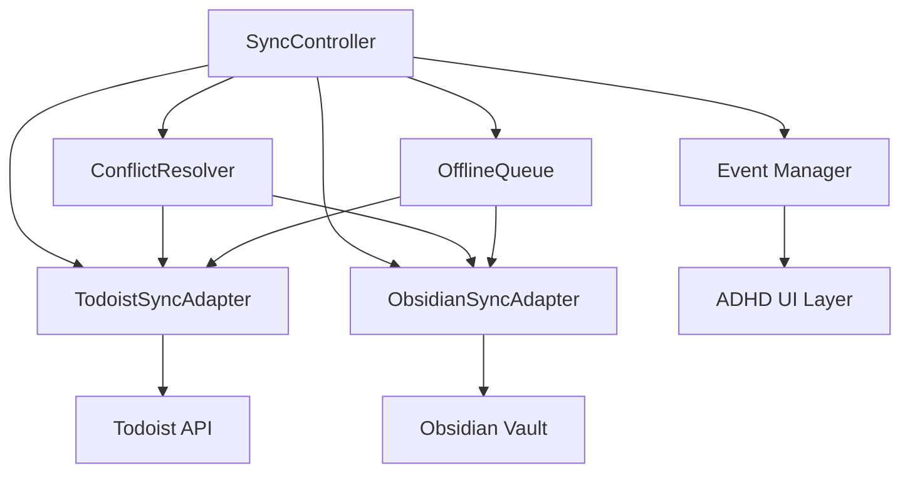
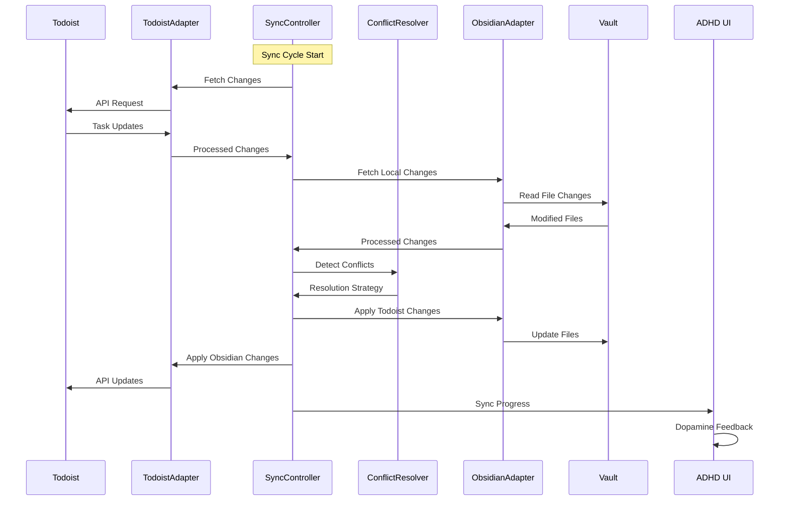

# Sync Engine - Design

## Overview

This document provides the design specifications for the Sync Engine, which manages bidirectional synchronization between Todoist and Obsidian with <5 second latency, 99.9% reliability, and automatic conflict resolution. The engine is the core component responsible for maintaining data consistency across both platforms while supporting offline scenarios and ADHD-optimized user experience.

## Component Architecture

### Core Components

#### 1. SyncController
- **Purpose**: Orchestrates all synchronization operations and manages sync state
- **Interface**: `ISyncController` with start/stop/status methods
- **Responsibilities**: Sync scheduling, state management, error coordination

#### 2. TodoistSyncAdapter
- **Purpose**: Handles all Todoist API interactions and data transformation
- **Interface**: `ITodoistAdapter` with CRUD operations for tasks/projects
- **Responsibilities**: API communication, rate limiting, data mapping

#### 3. ObsidianSyncAdapter
- **Purpose**: Manages Obsidian vault file operations and change detection
- **Interface**: `IObsidianAdapter` with file system operations
- **Responsibilities**: File I/O, change monitoring, markdown generation

#### 4. ConflictResolver
- **Purpose**: Automatically resolves synchronization conflicts using intelligent algorithms
- **Interface**: `IConflictResolver` with resolution strategy methods
- **Responsibilities**: Conflict detection, resolution logic, user notification

#### 5. OfflineQueue
- **Purpose**: Queues changes when offline and processes them when connection is restored
- **Interface**: `IOfflineQueue` with queue management operations
- **Responsibilities**: Change queuing, persistence, batch processing

### Component Relationships



## API Specifications

### SyncController API

```typescript
interface ISyncController {
  // Core sync operations
  initialize(config: SyncConfig): Promise<void>;
  startSync(): Promise<void>;
  stopSync(): void;
  pauseSync(): void;
  resumeSync(): void;
  
  // Status and monitoring
  getSyncStatus(): SyncStatus;
  getMetrics(): SyncMetrics;
  getLastSyncTime(): Date;
  
  // Manual operations
  forceSyncAll(): Promise<SyncResult>;
  syncSpecificTask(taskId: string): Promise<SyncResult>;
  
  // Event handling
  onSyncProgress(callback: (progress: SyncProgress) => void): void;
  onSyncComplete(callback: (result: SyncResult) => void): void;
  onSyncError(callback: (error: SyncError) => void): void;
}

interface SyncConfig {
  todoistApiToken: string;
  syncInterval: number; // milliseconds
  maxRetries: number;
  offlineMode: boolean;
  conflictResolution: 'automatic' | 'manual';
  adhdOptimizations: ADHDSyncConfig;
}

interface SyncMetrics {
  totalSyncs: number;
  successfulSyncs: number;
  failedSyncs: number;
  averageLatency: number; // milliseconds
  conflictsResolved: number;
  offlineQueueSize: number;
  lastSyncDuration: number;
}
```

### Data Structures

```typescript
interface SyncOperation {
  id: string;
  type: 'create' | 'update' | 'delete';
  source: 'todoist' | 'obsidian';
  target: 'todoist' | 'obsidian';
  data: TaskData | ProjectData;
  timestamp: Date;
  retryCount: number;
  priority: 'high' | 'medium' | 'low';
}

interface ConflictData {
  taskId: string;
  todoistVersion: TaskData;
  obsidianVersion: TaskData;
  conflictType: 'content' | 'status' | 'metadata';
  resolutionStrategy: string;
  autoResolvable: boolean;
}

interface SyncResult {
  success: boolean;
  operationsCompleted: number;
  operationsFailed: number;
  conflictsResolved: number;
  duration: number;
  errors: SyncError[];
}
```

## Data Flow

### Bidirectional Sync Flow



The sync engine processes changes in batches to optimize performance while maintaining real-time responsiveness. Each sync cycle includes change detection, conflict resolution, and bidirectional updates with comprehensive error handling.

## Error Handling

### Error Categories

1. **Network Errors**
   - Connection timeouts, API rate limits, service unavailable
   - **Recovery Strategy**: Exponential backoff with jitter, offline queue activation

2. **Data Conflicts**
   - Simultaneous edits, version mismatches, schema changes
   - **Recovery Strategy**: Automatic resolution using conflict resolver, user notification for manual conflicts

3. **File System Errors**
   - Permission issues, disk space, file locks
   - **Recovery Strategy**: Retry with different approach, graceful degradation, user notification

4. **API Errors**
   - Authentication failures, quota exceeded, malformed requests
   - **Recovery Strategy**: Token refresh, request throttling, data validation

### Error Recovery Mechanisms

- **Exponential Backoff**: Progressive retry delays to handle temporary failures
- **Circuit Breaker**: Prevent cascade failures by temporarily disabling failing operations
- **Graceful Degradation**: Continue core functionality when non-critical features fail
- **User Notification**: ADHD-friendly error messages with clear action steps

## Configuration

### Default Settings
- **syncInterval**: 30000ms - Balance between responsiveness and resource usage
- **maxRetries**: 3 - Sufficient for transient failures without excessive delays
- **conflictResolution**: 'automatic' - ADHD-optimized to minimize user decisions
- **offlineMode**: true - Support for hyperfocus sessions without internet

### Environment Variables
- `TODOIST_API_TOKEN`: User's Todoist API token for authentication
- `SYNC_DEBUG_MODE`: Enable detailed logging for troubleshooting
- `SYNC_PERFORMANCE_MODE`: Optimize for performance vs. battery life

### Configuration Schema

```typescript
interface SyncEngineConfig {
  performance: {
    syncInterval: number;
    batchSize: number;
    maxConcurrentOperations: number;
  };
  reliability: {
    maxRetries: number;
    timeoutMs: number;
    circuitBreakerThreshold: number;
  };
  adhd: {
    minimizeNotifications: boolean;
    autoResolveConflicts: boolean;
    preserveHyperfocus: boolean;
  };
}
```

## Performance Requirements

### Response Times
- Initial sync: < 10 seconds for 100 tasks
- Incremental sync: < 5 seconds for any number of changes
- Conflict resolution: < 2 seconds for automatic resolution

### Resource Usage
- Memory: < 50MB for typical usage (1000 tasks)
- CPU: < 5% during active sync operations
- Network: Optimized API calls with batching and caching

### Throughput
- Sync operations: 100+ tasks per minute
- API requests: Respect Todoist rate limits (450 requests per 15 minutes)

## Security Considerations

### API Token Security
- Secure storage using Obsidian's encrypted storage
- Token validation and refresh mechanisms
- No token logging or exposure in error messages

### Data Privacy
- All processing happens locally when possible
- Minimal data transmission (only changed fields)
- No data retention beyond operational requirements

## Testing Strategy

### Unit Tests
- SyncController state management and orchestration
- Adapter data transformation and error handling
- ConflictResolver algorithm validation
- OfflineQueue persistence and recovery

### Integration Tests
- End-to-end sync workflows with real APIs
- Offline/online transition scenarios
- Conflict resolution with various data combinations
- Performance testing with large datasets

### Performance Tests
- Sync latency measurement under various conditions
- Memory usage profiling during extended operations
- Network efficiency and API optimization validation

## Integration Points

### External Dependencies
- **Todoist REST API**: Task and project data synchronization
- **Obsidian Plugin API**: Vault access and file operations

### Internal Module Connections
- **Knowledge Engine**: Content analysis triggers for automatic linking
- **ADHD UI System**: Progress feedback and user notifications
- **File Management**: Convention-based file organization and naming

## Monitoring and Logging

### Log Levels
- **ERROR**: Sync failures, data corruption, critical issues
- **WARN**: Conflicts resolved, retries triggered, performance degradation
- **INFO**: Sync cycles completed, major state changes
- **DEBUG**: Detailed operation traces, API request/response data

### Metrics
- sync_operations_total: Counter of total sync operations
- sync_latency_seconds: Histogram of sync operation durations
- sync_conflicts_resolved: Counter of automatically resolved conflicts
- sync_errors_total: Counter of sync errors by type

### Health Checks
- api_connectivity: Todoist API reachability and authentication
- vault_access: Obsidian vault read/write permissions
- sync_lag: Time since last successful sync operation

## Future Enhancements

### Planned Features
- Smart sync scheduling based on user activity patterns
- Advanced conflict resolution with machine learning
- Real-time collaboration support for shared projects
- Sync analytics and optimization recommendations

### Scalability Considerations
- Horizontal scaling for enterprise deployments
- Distributed sync coordination for team workflows
- Advanced caching strategies for large datasets
- Performance optimization for mobile devices

### Technical Debt
- Refactor legacy sync algorithms for better maintainability
- Improve error message localization and ADHD-friendliness
- Optimize memory usage for very large task collections
