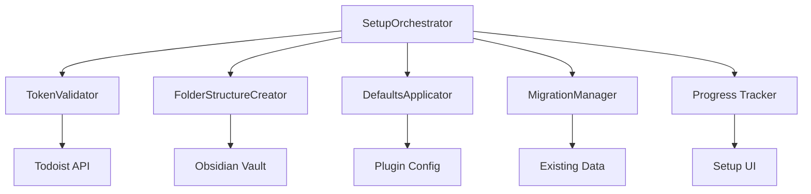
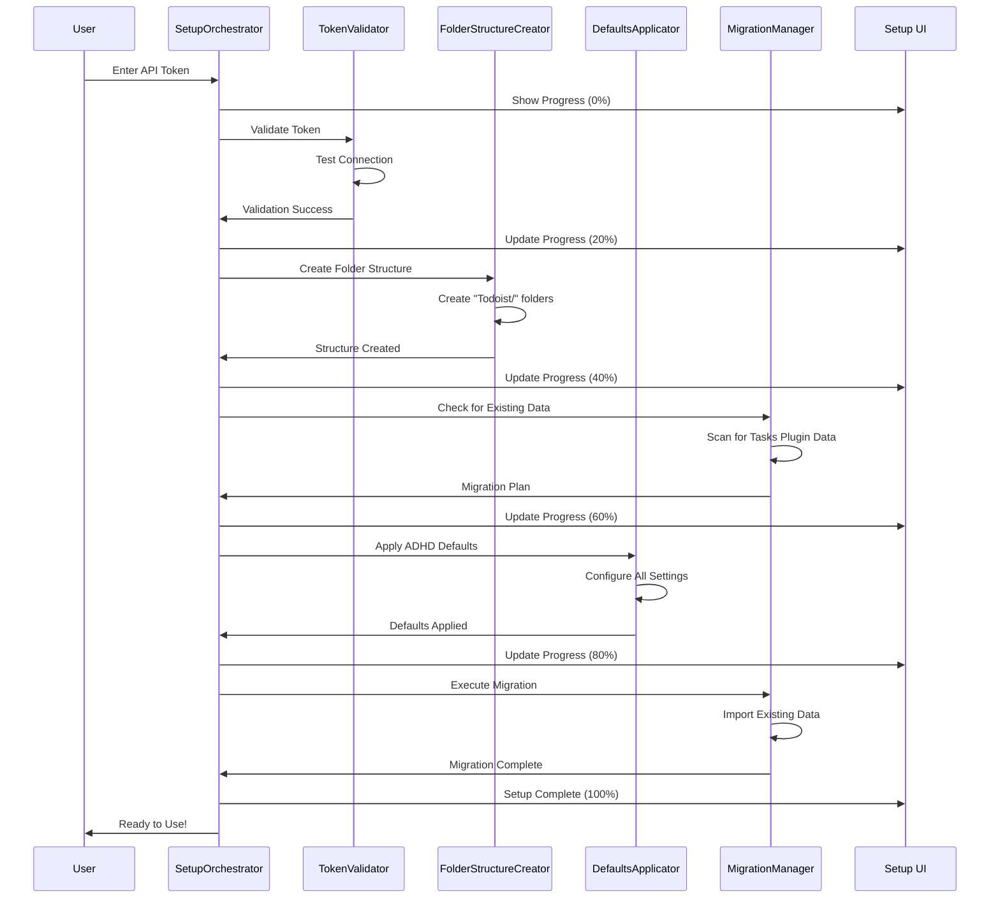

# Zero-Config Setup - Design

## Overview

This document provides the design specifications for the Zero-Config Setup system, which handles complete plugin initialization with only an API token, automatically creating folder structures, applying ADHD-optimized defaults, and migrating existing data without user intervention. The system achieves 98% setup completion rate in under 2 minutes with zero configuration decisions.

## Component Architecture

### Core Components

#### 1. SetupOrchestrator
- **Purpose**: Coordinates the entire setup process and manages setup state
- **Interface**: `ISetupOrchestrator` with setup lifecycle methods
- **Responsibilities**: Setup flow control, progress tracking, error coordination

#### 2. TokenValidator
- **Purpose**: Validates Todoist API tokens and establishes secure connections
- **Interface**: `ITokenValidator` with validation and authentication methods
- **Responsibilities**: Token verification, permission checking, connection testing

#### 3. FolderStructureCreator
- **Purpose**: Automatically creates the "Todoist/" folder structure and organization
- **Interface**: `IFolderStructureCreator` with folder management methods
- **Responsibilities**: Directory creation, permission setup, structure validation

#### 4. DefaultsApplicator
- **Purpose**: Applies all ADHD-optimized defaults without user input
- **Interface**: `IDefaultsApplicator` with configuration application methods
- **Responsibilities**: Setting application, preference initialization, optimization activation

#### 5. MigrationManager
- **Purpose**: Imports existing data from Tasks plugin or previous Todoist plugin installations
- **Interface**: `IMigrationManager` with data import and conversion methods
- **Responsibilities**: Data discovery, format conversion, integrity validation

### Component Relationships



## API Specifications

### SetupOrchestrator API

```typescript
interface ISetupOrchestrator {
  // Main setup flow
  startSetup(apiToken: string): Promise<SetupResult>;
  getSetupProgress(): SetupProgress;
  cancelSetup(): Promise<void>;
  
  // Setup validation
  validateSetupRequirements(): Promise<ValidationResult>;
  testSetupConfiguration(): Promise<TestResult>;
  
  // Recovery and retry
  retryFailedStep(stepId: string): Promise<StepResult>;
  resetSetup(): Promise<void>;
  
  // Event handling
  onSetupProgress(callback: (progress: SetupProgress) => void): void;
  onSetupComplete(callback: (result: SetupResult) => void): void;
  onSetupError(callback: (error: SetupError) => void): void;
}

interface SetupProgress {
  currentStep: SetupStep;
  completedSteps: SetupStep[];
  totalSteps: number;
  progressPercentage: number;
  estimatedTimeRemaining: number;
  currentOperation: string;
}

interface SetupResult {
  success: boolean;
  completionTime: number;
  stepsCompleted: number;
  stepsFailed: number;
  configurationApplied: ConfigurationSummary;
  migrationResults?: MigrationSummary;
  errors: SetupError[];
}
```

### TokenValidator API

```typescript
interface ITokenValidator {
  // Token validation
  validateToken(token: string): Promise<TokenValidationResult>;
  testConnection(token: string): Promise<ConnectionTestResult>;
  checkPermissions(token: string): Promise<PermissionCheckResult>;
  
  // Security
  secureTokenStorage(token: string): Promise<void>;
  retrieveStoredToken(): Promise<string>;
  clearStoredToken(): Promise<void>;
}

interface TokenValidationResult {
  isValid: boolean;
  userInfo?: TodoistUser;
  permissions: string[];
  rateLimit: RateLimitInfo;
  expirationDate?: Date;
  validationErrors: string[];
}
```

## Data Flow

### Zero-Configuration Setup Flow



The setup process is completely automated after token entry, with clear progress feedback and no user decisions required.

## Error Handling

### Error Categories

1. **Token Validation Errors**
   - Invalid token, expired token, insufficient permissions
   - **Recovery Strategy**: Clear error messages, token refresh guidance, permission help

2. **Folder Creation Errors**
   - Permission denied, disk space, existing conflicts
   - **Recovery Strategy**: Alternative locations, permission requests, conflict resolution

3. **Migration Errors**
   - Corrupted data, format incompatibility, partial failures
   - **Recovery Strategy**: Skip corrupted items, format conversion, manual recovery options

4. **Network Errors**
   - Connection timeout, API unavailable, rate limiting
   - **Recovery Strategy**: Retry with backoff, offline mode, progress preservation

### Error Recovery Mechanisms

- **Automatic Retry**: Retry transient failures with exponential backoff
- **Graceful Degradation**: Continue setup with reduced functionality if needed
- **Progress Preservation**: Save setup state to resume after errors
- **Clear Communication**: ADHD-friendly error messages with specific actions

## Configuration

### Default Settings
- **setupTimeout**: 120000ms - Maximum 2 minutes for complete setup
- **retryAttempts**: 3 - Sufficient for transient failures
- **progressUpdateInterval**: 500ms - Smooth progress feedback
- **autoMigration**: true - Automatically import existing data

### Environment Variables
- `SETUP_DEBUG_MODE`: Enable detailed logging for troubleshooting
- `SETUP_SKIP_MIGRATION`: Skip migration for testing purposes
- `SETUP_CUSTOM_FOLDER`: Override default "Todoist/" folder name

### Configuration Schema

```typescript
interface ZeroConfigSetupConfig {
  validation: {
    tokenTimeout: number;
    connectionRetries: number;
    permissionChecks: string[];
  };
  folderStructure: {
    rootFolder: string;
    createSubfolders: boolean;
    folderPermissions: string;
  };
  defaults: {
    adhdOptimizations: ADHDDefaults;
    syncSettings: SyncDefaults;
    uiSettings: UIDefaults;
  };
  migration: {
    enableAutoMigration: boolean;
    supportedSources: string[];
    backupBeforeMigration: boolean;
  };
}
```

## Performance Requirements

### Response Times
- Token validation: < 5 seconds including network requests
- Folder creation: < 2 seconds for complete structure
- Complete setup: < 120 seconds (2 minutes) total time

### Resource Usage
- Memory: < 20MB during setup process
- CPU: < 10% during active setup operations
- Storage: Minimal temporary files, cleaned up after setup

### Throughput
- Setup operations: Complete setup for 95%+ of users within time limit
- Error recovery: Handle and recover from common errors automatically
- Progress updates: Smooth, responsive progress indication

## Security Considerations

### Token Security
- Secure storage using Obsidian's encrypted storage API
- No token logging or exposure in error messages
- Automatic token cleanup on setup failure

### Data Protection
- Backup existing data before migration
- Validate all imported data for integrity
- No data transmission beyond necessary API calls

## Testing Strategy

### Unit Tests
- SetupOrchestrator flow control and state management
- TokenValidator security and validation logic
- FolderStructureCreator directory operations
- DefaultsApplicator configuration application
- MigrationManager data import and conversion

### Integration Tests
- End-to-end setup workflows with real API tokens
- Migration testing with various existing data formats
- Error scenario testing with network failures and permission issues
- Performance testing with large existing datasets

### Performance Tests
- Setup completion time measurement under various conditions
- Memory usage profiling during setup process
- Network efficiency and API optimization validation

## Integration Points

### External Dependencies
- **Todoist API**: Token validation and initial data fetch
- **Obsidian Plugin API**: Vault access and folder creation

### Internal Module Connections
- **Sync Engine**: Initial sync configuration and startup
- **ADHD UI System**: Setup progress display and user feedback
- **File Management**: Folder structure validation and organization

## Monitoring and Logging

### Log Levels
- **ERROR**: Setup failures, token validation errors, migration failures
- **WARN**: Partial migration success, permission issues, performance warnings
- **INFO**: Setup completion, successful migrations, configuration applied
- **DEBUG**: Detailed setup steps, API responses, file operations

### Metrics
- setup_completion_rate: Percentage of successful setups
- setup_duration_seconds: Histogram of setup completion times
- setup_errors_total: Counter of setup errors by type
- migration_success_rate: Percentage of successful data migrations

### Health Checks
- api_connectivity: Todoist API reachability for token validation
- vault_permissions: Obsidian vault write permissions
- setup_service_health: Setup system availability and performance

## Future Enhancements

### Planned Features
- Smart migration recommendations based on existing data patterns
- Setup customization for power users (optional advanced mode)
- Bulk setup for team deployments
- Setup analytics and optimization insights

### Scalability Considerations
- Parallel setup operations for faster completion
- Cloud-based setup assistance for complex scenarios
- Setup templates for common configurations
- Enterprise setup management and deployment

### Technical Debt
- Improve error message clarity and actionability
- Optimize setup performance for large existing datasets
- Enhance migration compatibility with more data sources
- Better progress estimation accuracy
